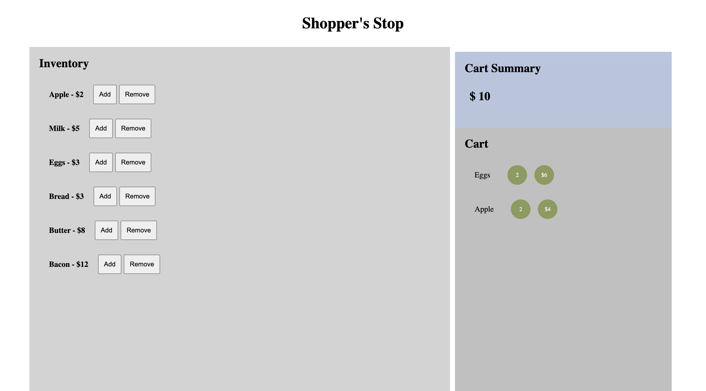

# shopping cart

This is a very simple shopping cart demonstration with celestial's RTK definition.



## How to run

1. Use populate_database.sql to create and populate a sample PostgreSQL database.
2. Install server dependencies with ```pip3 install -r requirements.txt```
3. Start server with ```python3 app.py```
3. Install client dependencies with ```npm install```
4. Start client with ```npm start```. App will be available at http://localhost:3000

## Generating RTK definitions
`npx celestial ./openapispec.json ./client/src/celestial`